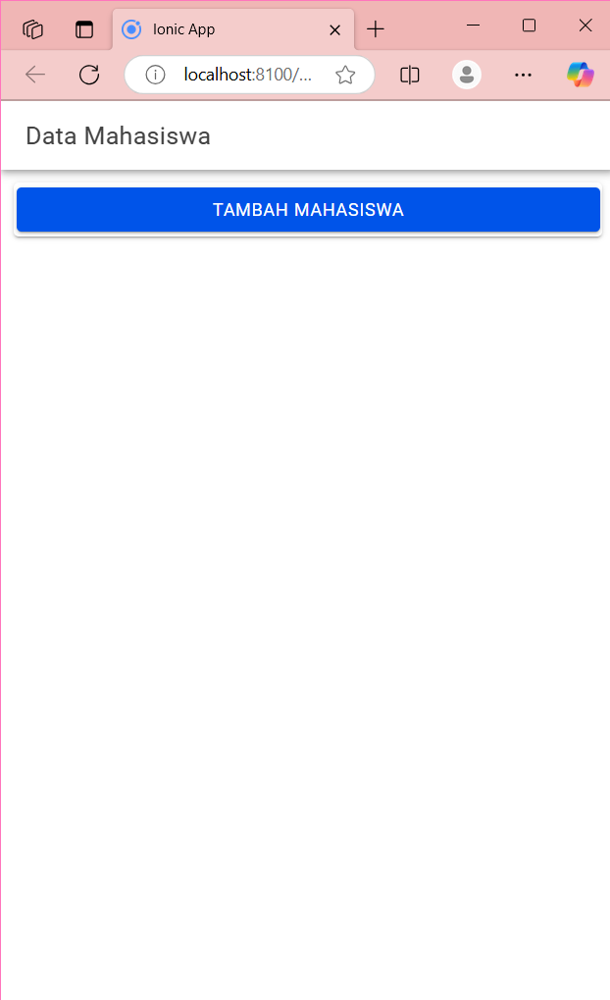
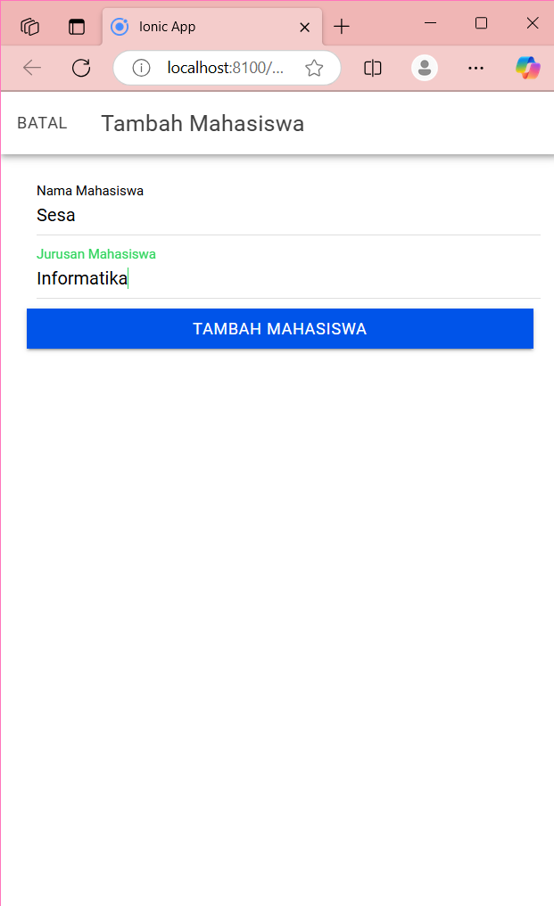
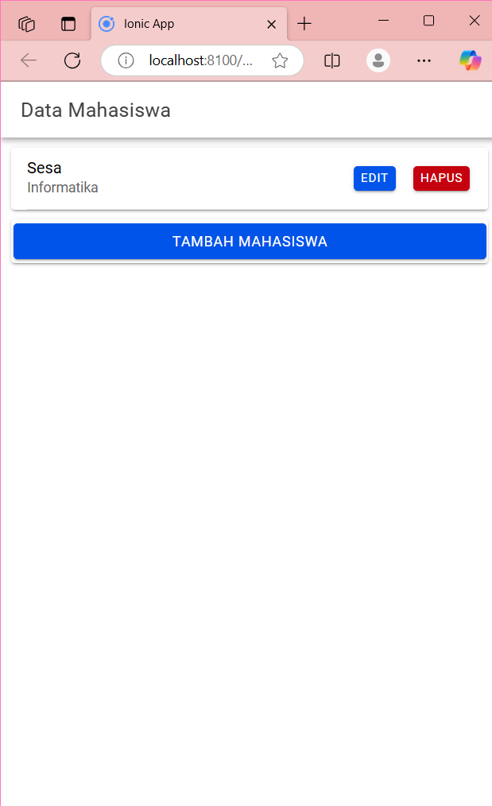
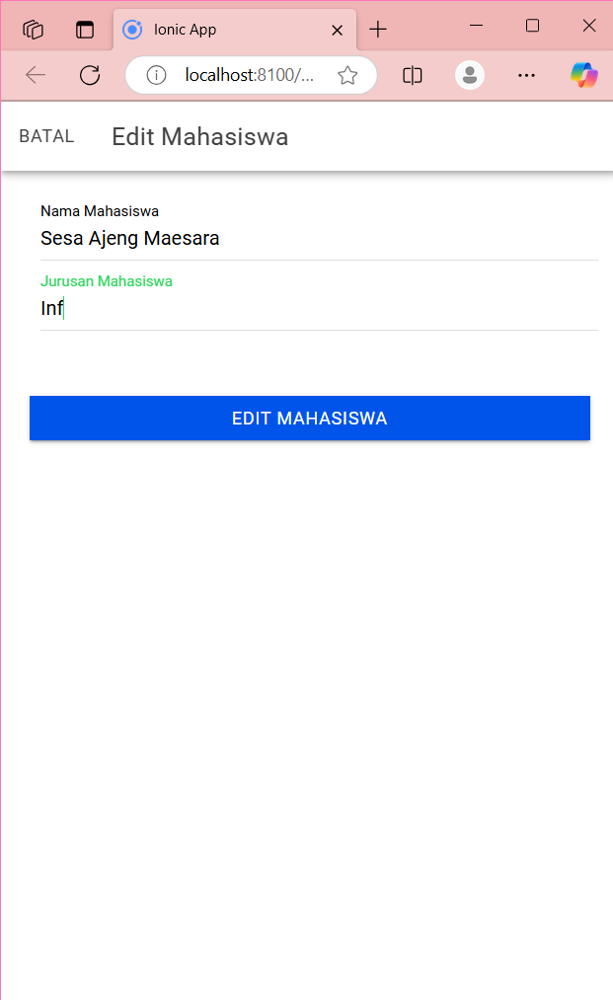
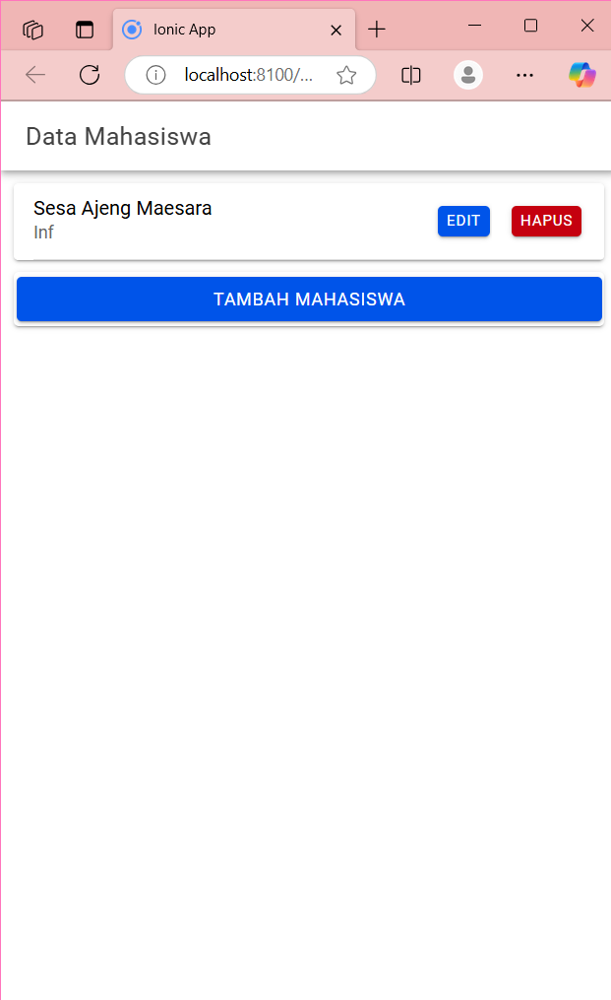
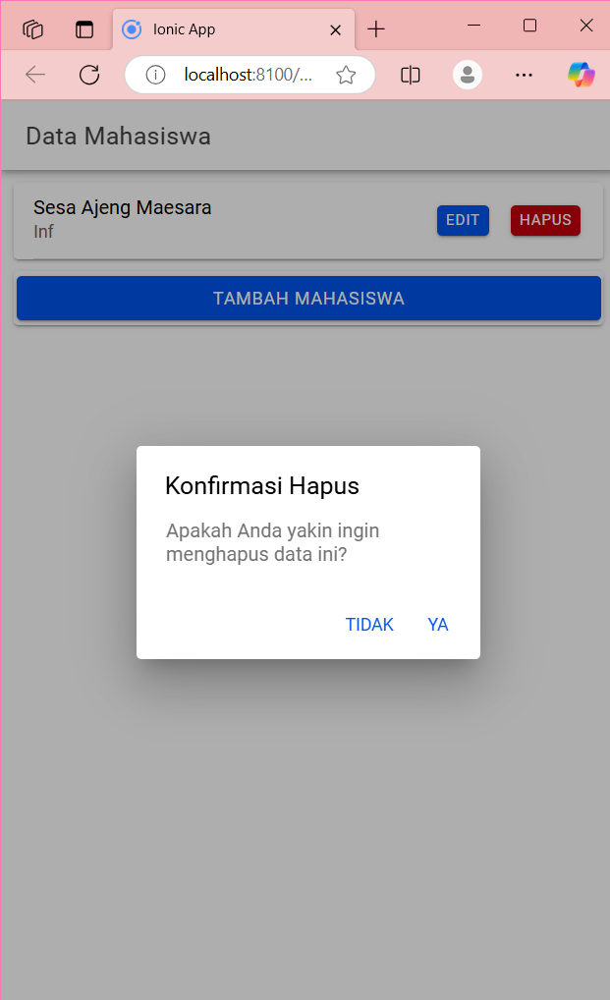

# Penjelasan Proses
Penjelasan tampilan antarmuka halaman
1. Header :
  
<ion-header [translucent]="true">
  <ion-toolbar>
    <ion-title>Data Mahasiswa</ion-title>
  </ion-toolbar>
</ion-header>

- ion-header digunakan untuk menampilkan judul halaman di bagian atas.

2. Menampilkan Daftar Mahasiswa :

  <ion-card *ngFor="let item of dataMahasiswa">
  <ion-item>
    <ion-label>
      {{item.nama}}
      
{{item.jurusan}}

    </ion-label>
    <ion-button color="danger" slot="end" (click)="konfirmasiHapus(item.id)">Hapus</ion-button>
    <ion-button expand="block" (click)="openModalEdit(true, item.id)">Edit</ion-button>
  </ion-item>
</ion-card>

 - Menggunakan *ngFor untuk menampilkan setiap item dalam dataMahasiswa sebagai daftar ion-card.
 - Tombol Hapus mengarah ke fungsi konfirmasiHapus() untuk memunculkan dialog konfirmasi.
 - Tombol Edit mengarah ke fungsi openModalEdit() yang membuka modal untuk mengedit data.
   
4. Tombol Tambah Mahasiswa

   <ion-card>
  <ion-button (click)="openModalTambah(true)" expand="block">Tambah Mahasiswa</ion-button>
</ion-card>

- Tombol ini mengarahkan ke fungsi openModalTambah() yang membuka modal untuk menambah data mahasiswa.
  
6. Modal Tambah Mahasiswa

<ion-modal [isOpen]="modalTambah">
  <!-- Konten modal tambah -->
</ion-modal>

- ion-modal dengan isOpen yang dikontrol oleh variabel modalTambah.
- Menggunakan ion-input untuk input nama dan jurusan, serta tombol Tambah Mahasiswa yang memanggil tambahMahasiswa() untuk menyimpan data.
   
8. Modal Edit Mahasiswa

<ion-modal [isOpen]="modalEdit">
  <!-- Konten modal edit -->
</ion-modal>

- ion-modal ini dikontrol oleh modalEdit.
- Memiliki input untuk nama, jurusan, dan tombol Edit Mahasiswa yang memanggil editMahasiswa().

Penjelasan Logika dan proses yang berkaitan dengan pengelolaan data
1. Atribut Kelas:
- dataMahasiswa: Menyimpan data mahasiswa dari server.
- modalTambah, modalEdit: Kontrol untuk menampilkan modal.
- id, nama, jurusan: Menyimpan nilai untuk mahasiswa yang sedang diedit atau ditambah.

2. Fungsi di Kelas:
- ngOnInit:
  1. Fungsi ini dipanggil sekali ketika halaman dimuat. Fungsi ini memanggil getMahasiswa() untuk mengambil data mahasiswa dari server.
- resetModal():
  1. Fungsi ini mereset nilai id, nama, dan jurusan ketika modal dibuka atau ditutup, sehingga input di modal kosong saat dibuka.
- openModalTambah():
  1. Membuka modal untuk menambah data. Mengatur modalTambah ke true dan modalEdit ke false.
- cancel():
  1. Menutup modal yang sedang aktif dan mengatur kembali variabel modalTambah dan modalEdit ke false.
- openModalEdit():
  1. Membuka modal untuk mengedit data mahasiswa berdasarkan id mahasiswa yang diberikan. Fungsi ini juga memanggil ambilMahasiswa() untuk mengambil data spesifik mahasiswa yang ingin diedit.
- getMahasiswa():
  1. Mengambil data mahasiswa dari server menggunakan ApiService dan menyimpannya di dataMahasiswa.
- tambahMahasiswa():
  1. Menambah data mahasiswa dengan nilai nama dan jurusan yang dimasukkan ke server.
  2. Jika proses berhasil, modal ditutup dan data mahasiswa diperbarui dengan memanggil getMahasiswa().
- konfirmasiHapus():
  1. Menampilkan dialog konfirmasi menggunakan AlertController sebelum menghapus data mahasiswa.
- hapusMahasiswa():
  1. Menghapus data mahasiswa berdasarkan id dengan mengirim permintaan ke server.
  2. Setelah penghapusan berhasil, memanggil getMahasiswa() untuk memperbarui daftar.
- ambilMahasiswa():
  1. Mengambil data spesifik mahasiswa dari server berdasarkan id, lalu mengisinya di nama dan jurusan pada modal.
- editMahasiswa():
  1. Mengirim data mahasiswa yang diperbarui ke server dan memperbarui daftar mahasiswa setelah berhasil.

# Screenshot Hasil

Halaman Awal

Halaman Tambah

Halaman Edit

Halaman Hapus

